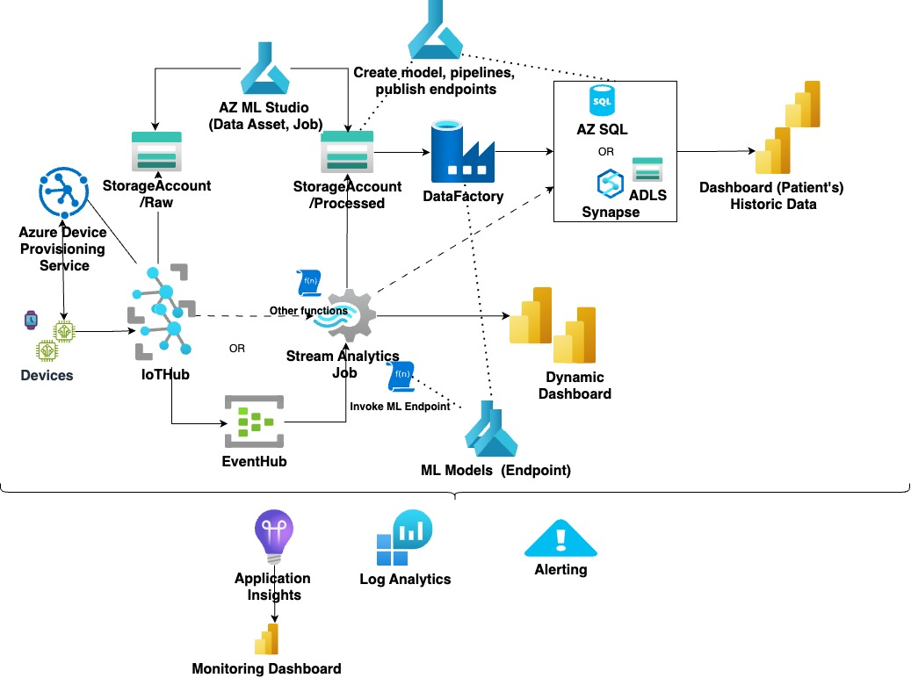

# Azure IoT-Based Real-Time Data Pipeline

This project provisions a real-time data pipeline for capturing, processing, and analyzing data from IoT devices. The data pipeline is built on Azure services and incorporates machine learning, monitoring, and alerting functionalities.

## Overview

### Components:

1. **Devices & IoT Hub:**
    - IoT devices send real-time telemetry data.
    - **Azure IoT Hub** ingests the telemetry data from the devices.
    - Devices are registered and managed through **Azure Device Provisioning Service (DPS)**, enabling secure device-to-cloud communication.

2. **Event Hub:**
    - IoT Hub forwards the telemetry data to **Azure Event Hub** for further processing.

3. **Azure Storage (Raw and Processed):**
    - **Raw Storage**: Stores the raw telemetry data in **Azure Blob Storage**.
    - **Processed Storage**: Stores processed data, either from machine learning models or analytics jobs, in a separate **Blob Storage** container.

4. **Stream Analytics Job:**
    - Real-time analytics are performed on the incoming data using **Azure Stream Analytics**.
    - Custom functions or machine learning models, via **Azure Functions**, can be applied to the incoming data.

5. **Azure Machine Learning (ML Models & Studio):**
    - **Azure ML Studio** is used to train and deploy machine learning models.
    - These models are used to process the telemetry data and provide insights, which are then stored and visualized.

6. **Azure Data Factory:**
    - **Azure Data Factory** orchestrates data pipelines, moving data between the various components.
    - Processed data is stored in **Azure SQL Database** or **Azure Synapse Analytics (ADLS)** for historical analysis and dashboarding.

7. **Dashboards:**
    - **Dynamic Dashboard**: Provides real-time insights based on live telemetry data from devices.
    - **Historical Data Dashboard**: Displays insights based on long-term data stored in **Azure SQL** or **Azure Synapse Analytics**.

8. **Monitoring & Alerting:**
    - **Application Insights** and **Log Analytics** are used for continuous monitoring of the data pipeline.
    - Alerts are configured for critical events using **Azure Monitor**.

### Monitoring:
The system includes a robust monitoring and alerting setup for real-time health checks on the data pipeline and IoT devices. **Application Insights** and **Log Analytics** dashboards allow for monitoring system performance, while **Alerts** are triggered for significant issues.

## Terraform Resources

This project uses Terraform to automate the provisioning of the Azure resources mentioned above. Below is a summary of the resources created:

- **Resource Group**: Contains all the resources for the IoT data pipeline.
- **Azure IoT Hub**: Ingests data from IoT devices.
- **Azure Device Provisioning Service (DPS)**: Facilitates secure and scalable device registration and provisioning.
- **Event Hub**: Forwards IoT data for real-time processing.
- **Azure Storage Accounts**: Stores raw and processed telemetry data.
- **Azure Stream Analytics Job**: Processes and analyzes telemetry data in real-time.
- **Azure Machine Learning**: Trains and serves machine learning models for data processing.
- **Azure Data Factory**: Moves and transforms data between components.
- **Dashboards**: Provides visual insights into both real-time and historical data.
- **Monitoring Tools**: Application Insights and Log Analytics for real-time monitoring of the system.
- **Alerts**: Configures notifications for critical events.
